# TAI Workflow Engine

[](https://openjdk.java.net/)
[](https://spring.io/projects/spring-boot)
[](LICENSE)

> A control-plane-oriented, DAG (Directed Acyclic Graph) based workflow engine with support for parallel execution, retry, rollback, signal waiting, and other advanced features, purpose-built for complex business orchestration.

---

## Why TAI Workflow? — Competitive Analysis

When selecting a workflow engine, there are numerous open-source options on the market. This section provides a detailed analysis of TAI Workflow versus mainstream alternatives, helping you understand our unique advantages in **complex business orchestration scenarios**.

### Competitor Overview

| Category | Product | Positioning |
|----------|---------|-------------|
| **BPM Engine** | Apache Activiti, jBPM | Enterprise business process management, focused on manual approvals and form workflows |
| **Task Scheduling** | Apache DolphinScheduler, Apache Airflow | Big data batch processing, ETL task scheduling and orchestration |
| **Cloud-Native Orchestration** | Kubernetes Argo Workflow | Containerized task orchestration, CI/CD scenarios |
| **AI Application Framework** | Spring AI Alibaba, LangChain | LLM application development framework, AI capability integration |
| **AI Agent Orchestration** | Dify, n8n | LLM application orchestration, low-code automation |
| **Complex Business Orchestration** | **TAI Workflow** | Complex business orchestration, strong consistency, Saga pattern |

### Detailed Comparison Matrix

```
+-------------------------+-----------+-----------+-----------+-----------+-----------+-----------+-----------+-----------+
|        Feature          | TAI       | Activiti  | Airflow   | Argo      | Dolphin   | Spring AI | LangChain | Dify/n8n  |
|                         | Workflow  | / jBPM    |           | Workflow  | Scheduler | Alibaba   |           |           |
+-------------------------+-----------+-----------+-----------+-----------+-----------+-----------+-----------+-----------+
| Saga Rollback           | Native    | Ext Req'd | No        | No        | No        | No        | No        | No        |
| Parent-Child Workflow   | Native    | CallAct   | SubDAG    | Nested    | SubFlow   | No        | SubChain  | SubFlow   |
| Signal Mechanism        | Native    | Message   | Sensor    | Event     | No        | No        | Callback  | Webhook   |
| Activity Fail Strategy  | Native    | Config    | Global    | Template  | Task-lvl  | Retry     | Fallback  | No        |
| Failure Retry           | Native    | Job Retry | Retry     | Retry     | Retry     | Limited   | Limited   | Limited   |
| Millisecond Response    | <10ms     | 100ms+    | Seconds   | Seconds   | Seconds   | LLM Dep.  | LLM Dep.  | LLM Dep.  |
| Optimistic Lock Control | Native    | No        | No        | No        | No        | No        | No        | No        |
| Embedded Deployment     | SDK       | Partial   | Standalone| K8s       | Standalone| SDK       | Library   | SaaS      |
| Runtime Overhead        | Minimal   | Medium    | High      | High      | High      | Medium    | Medium    | High      |
| Code-as-Process         | Java      | BPMN      | Python    | YAML      | Config    | Java      | Python    | Visual    |
| Failover                | Auto      | Cluster   | Celery    | K8s       | Cluster   | Config    | Config    | Cloud     |
| Learning Curve          | Low       | High      | Medium    | Medium    | Medium    | Low       | Medium    | Low       |
+-------------------------+-----------+-----------+-----------+-----------+-----------+-----------+-----------+-----------+
| Execution Determinism   | 100%      | 100%      | 100%      | 100%      | 100%      | Non-det.  | Non-det.  | Non-det.  |
| LLM Integration         | Extensible| No        | Extensible| Extensible| Extensible| Native    | Native    | Native    |
| RAG Support             | No        | No        | No        | No        | No        | Native    | Native    | Native    |
| Agent Capability        | No        | No        | No        | No        | No        | Native    | Native    | Native    |
| Vector DB Integration   | No        | No        | No        | No        | No        | Native    | Native    | Native    |
| Prompt Management       | No        | No        | No        | No        | No        | Native    | Native    | Native    |
| Multi-Model Support     | No        | No        | No        | No        | No        | Native    | Native    | Native    |
+-------------------------+-----------+-----------+-----------+-----------+-----------+-----------+-----------+-----------+

Native Support  |  Partial Support / Extra Config Required  |  Not Supported / Not Applicable
```

### Key Capabilities at a Glance

As the table above shows, different types of frameworks have different strengths:

| Framework Type | Representative Products | Core Strengths | Applicable Scenarios |
|---------------|------------------------|----------------|---------------------|
| **Business Orchestration** | TAI Workflow | Saga transactions, deterministic execution, millisecond response | Order processing, fund transfers, multi-service orchestration |
| **BPM Engine** | Activiti/jBPM | BPMN standard, approval workflows, form integration | OA systems, manual approvals, contract management |
| **Task Scheduling** | Airflow/Dolphin | Scheduled tasks, DAG visualization, data pipelines | ETL, report generation, batch processing |
| **Cloud-Native Orchestration** | Argo Workflow | K8s native, container orchestration, CI/CD | ML Pipeline, image builds, test pipelines |
| **AI Application Framework** | Spring AI/LangChain | LLM integration, RAG, Agent | Intelligent customer service, knowledge Q&A, AI application development |
| **AI Low-Code** | Dify/n8n | Visual orchestration, rapid setup, SaaS | AI prototype validation, office automation |

### TAI Workflow Differentiating Capabilities

#### Sub-Workflow (Parent-Child Workflow)

Supports nested workflow invocation. A parent workflow can start a child workflow and wait for its completion, with the child workflow's context propagated back to the parent.

```java
// Define a sub-workflow Activity
ActivityDefinition.builder()
    .name("executeSubWorkflow")
    .activityClass(SubWorkflowActivity.class)
    .build()

// After the child workflow completes, results are automatically merged into the parent workflow context
```

#### Signal Mechanism

Supports external systems triggering workflow state transitions via signals, suitable for asynchronous callbacks, manual approvals, and similar scenarios.

```java
// Define a signal-waiting Activity
ActivityDefinition.builder()
    .name("waitPaymentCallback")
    .signalBizCode("payment_callback")  // Wait for payment callback signal
    .build()

// External system sends a signal
workflowDriver.signalWorkflowInstance(workflowId, "payment_callback", SignalAction.SUCCESS, context);
```

#### Activity Fail Strategy

Each Activity can independently configure its failure handling strategy, flexibly handling different business scenarios:

| Strategy | Description | Applicable Scenario |
|----------|-------------|---------------------|
| `ROLLBACK` | Trigger Saga rollback | Critical business steps requiring consistency |
| `CONTINUE_RUN` | Skip failure and continue execution | Non-critical steps, e.g., sending notifications |
| `HUMAN_PROCESSING` | Enter manual processing | Scenarios requiring human intervention |

```java
ActivityDefinition.builder()
    .name("deductBalance")
    .activityClass(DeductBalanceActivity.class)
    .activityFailStrategy(ActivityFailStrategy.ROLLBACK)  // Rollback on failure
    .maxRetry(3)                                          // Max 3 retries
    .retryIntervalMillis(5000)                            // 5-second retry interval
    .build()
```

#### Failure Retry

Supports Activity-level failure retry configuration, including retry count and retry interval:

```java
ActivityDefinition.builder()
    .name("callExternalApi")
    .activityClass(ExternalApiActivity.class)
    .maxRetry(5)                    // Max retry count
    .retryIntervalMillis(10000)     // 10-second retry interval
    .build()
```

---

### Scenario-Based Deep Comparisons

#### 1. vs Apache Activiti / jBPM (BPM Engines)

| Dimension | TAI Workflow | Activiti / jBPM |
|-----------|-------------|-----------------|
| **Design Philosophy** | Complex business orchestration, code-first | Business process management, BPMN standard |
| **Core Scenarios** | Complex business workflows, multi-step operations, Saga transactions | Manual approvals, form routing, OA systems |
| **Process Definition** | Java Builder API, type-safe | BPMN 2.0 XML, requires designer |
| **Rollback Capability** | Native Saga compensation, automatic rollback in reverse topological order | Manual compensation logic required |
| **Performance** | 10,000+ TPS per node | 1,000 TPS per node |
| **Deployment Model** | SDK embedded, no external dependencies | Standalone service or embedded, heavy dependencies |

**TAI Workflow Advantages**:
- **No BPMN Learning Curve**: Define processes directly in Java code, IDE-friendly, easy to refactor
- **Native Saga Support**: Distributed transaction compensation for complex business scenarios is a first-class citizen, not an add-on
- **Lightweight**: No process designer, form engine, or other BPM baggage — fast startup, minimal footprint

```java
// TAI Workflow: Clean Java API
WorkflowDefinition.builder()
    .name("transfer-workflow")
    .addNode(ActivityDefinition.builder()
        .name("debit")
        .activityClass(DebitActivity.class)
        .activityFailStrategy(ActivityFailStrategy.ROLLBACK)  // Auto rollback on failure
        .build())
    .addEdge("debit", "credit")
    .build();

// vs Activiti: Requires BPMN XML + compensation handlers
// <bpmn:serviceTask id="debit" camunda:class="...">
//   <bpmn:extensionElements>
//     <camunda:failedJobRetryTimeCycle>R3/PT10S</camunda:failedJobRetryTimeCycle>
//   </bpmn:extensionElements>
// </bpmn:serviceTask>
```

---

#### 2. vs Apache DolphinScheduler / Apache Airflow (Task Scheduling)

| Dimension | TAI Workflow | DolphinScheduler / Airflow |
|-----------|-------------|---------------------------|
| **Design Philosophy** | Real-time business orchestration | Batch task scheduling |
| **Core Scenarios** | Complex business orchestration, API orchestration, real-time processing | ETL, data pipelines, scheduled tasks |
| **Plane Positioning** | **Control Plane** | **Data Plane** |
| **Trigger Method** | API calls, event-driven | Scheduled, manual trigger |
| **Execution Latency** | Milliseconds (<10ms) | Seconds to minutes |
| **Scheduling Model** | Event-driven, instant response | Polling-based, periodic execution |
| **Deployment Complexity** | SDK embedded, zero external dependencies | Requires standalone cluster, database, message queue |

**Control Plane vs Data Plane**

```
+-----------------------------------+-------------------------------------------+
|      Control Plane                |        Data Plane                         |
|         TAI Workflow              |     DolphinScheduler / Airflow            |
+-----------------------------------+-------------------------------------------+
|  - Business process orchestration |  - Data processing task scheduling        |
|  - Real-time decisions, state     |  - Batch data movement & transformation   |
|    transitions                    |  - ETL Pipeline execution                 |
|  - Inter-service call             |  - Resource scheduling & allocation       |
|    orchestration                  |  - Throughput-oriented                    |
|  - Transaction consistency        |                                           |
|  - Millisecond response required  |                                           |
+-----------------------------------+-------------------------------------------+
|  Typical scenarios:               |  Typical scenarios:                       |
|  - Order state transitions        |  - Daily report generation                |
|  - Multi-service coordination     |  - Data warehouse sync                    |
|  - Approval process advancement   |  - Log aggregation                        |
|  - Async callback handling        |  - ML training Pipeline                   |
+-----------------------------------+-------------------------------------------+
```

**TAI Workflow Advantages**:
- **Control Plane Focus**: Purpose-built for business process orchestration, not data movement tasks
- **Real-Time Response**: Millisecond execution when a business request is initiated, no waiting for the next scheduling cycle
- **Embedded Execution**: Integrated as an SDK into business services, no need to maintain a standalone scheduling cluster
- **Transaction Semantics**: Native failure rollback support, not just simple task retry

```
Control Plane (TAI Workflow):
User Request --> Business Orchestration --> Immediate Execution --> Millisecond Response
                    |
                    +-- Ideal for: Order processing, state transitions, service orchestration

Data Plane (Airflow/DolphinScheduler):
Scheduled Trigger --> Task Scheduling --> Batch Processing --> Minutes to hours to complete
                    |
                    +-- Ideal for: Daily reports, data sync, ETL tasks
```

---

#### 3. vs Kubernetes Argo Workflow (Cloud-Native Orchestration)

| Dimension | TAI Workflow | Argo Workflow |
|-----------|-------------|---------------|
| **Design Philosophy** | In-application transaction orchestration | Containerized task orchestration |
| **Core Scenarios** | Complex business workflows, service orchestration | CI/CD, ML Pipeline, batch processing |
| **Execution Unit** | Java method invocation | Container Pod |
| **Startup Overhead** | Microseconds (method call) | Seconds (Pod creation) |
| **Infrastructure** | Pure Java, any environment | Strong Kubernetes dependency |
| **State Management** | Database persistence | etcd + CRD |
| **Communication** | In-process direct invocation | Inter-Pod network communication |

**TAI Workflow Advantages**:
- **Zero Container Overhead**: Each Activity is a method call, not a Pod — 10-100x resource savings
- **No K8s Dependency**: Runs on any JVM environment — bare metal, VMs, or containers
- **Simple Data Sharing**: Activities share data via in-memory Context, no Volume mounts or S3 needed

```
TAI Workflow Execution Model:
+-------------------------------------+
|           JVM Process               |
|  +---------+---------+---------+   |
|  |Activity |Activity |Activity |   |
|  |   A     |   B     |   C     |   |  <-- Method call, microseconds
|  +---------+---------+---------+   |
|       Shared WorkflowContext        |
+-------------------------------------+

Argo Workflow Execution Model:
+---------+   +---------+   +---------+
|  Pod A  |-->|  Pod B  |-->|  Pod C  |   <-- Pod creation, seconds
+---------+   +---------+   +---------+
     |             |             |
     +-------- Volume/S3 -------+
```

---

#### 4. vs Dify / n8n (AI Agent Orchestration)

| Dimension | TAI Workflow | Dify / n8n |
|-----------|-------------|------------|
| **Design Philosophy** | Deterministic transaction orchestration | AI application / automation orchestration |
| **Core Scenarios** | Complex business workflows, strong consistency | LLM applications, office automation |
| **Execution Determinism** | 100% deterministic | LLM output is non-deterministic |
| **Transaction Guarantee** | ACID / Saga | No transaction semantics |
| **Process Definition** | Java code, testable | Visual drag-and-drop |
| **Deployment Model** | Private deployment, data stays in-house | Mostly SaaS, data goes to cloud |
| **Performance SLA** | Millisecond SLA achievable | Depends on LLM response time |

**TAI Workflow Advantages**:
- **Deterministic Execution**: Critical business scenarios cannot tolerate LLM "hallucinations" — every step must be predictable
- **Data Security**: Business data and sensitive information cannot be sent to third-party SaaS
- **Auditability**: Complete logs for every execution step, meeting compliance audit requirements

```
Complex Business Scenarios:
TAI Workflow: User balance $100 --> Deduct $50 --> Balance $50 (100% certain)
AI Agent:     User balance $100 --> LLM decides deduction amount --> Balance ??? (unacceptable)

Scenarios Suitable for AI Agents:
- Customer service chat, content generation, data analysis
- Lower precision requirements for execution results
```

---

#### 5. vs Spring AI Alibaba / LangChain (AI Application Frameworks)

Spring AI Alibaba and LangChain are currently the two most popular AI application development frameworks:
- **Spring AI Alibaba**: Built by Alibaba on top of Spring AI, targeting the Java/Spring ecosystem
- **LangChain**: The most popular LLM application framework in the Python/JavaScript ecosystem

Both focus on LLM application development, with fundamental differences from TAI Workflow in design philosophy and use cases.

| Dimension | TAI Workflow | Spring AI Alibaba | LangChain |
|-----------|-------------|-------------------|-----------|
| **Design Philosophy** | Deterministic business process orchestration | AI application development framework | LLM application orchestration framework |
| **Language Ecosystem** | Java/Spring | Java/Spring | Python/JavaScript |
| **Core Scenarios** | Complex business workflows, Saga transactions | LLM conversations, RAG, AI Agent | LLM Chain, RAG, Agent |
| **Execution Model** | DAG topological execution, deterministic transitions | Function Calling, Prompt chains | Chain/Agent pattern |
| **Process Definition** | Java Builder API, type-safe | Prompt Template + Tool | LCEL expression language |
| **Execution Determinism** | 100% deterministic | LLM output is non-deterministic | LLM output is non-deterministic |
| **Transaction Support** | Native Saga compensation rollback | No transaction semantics | No transaction semantics |
| **State Persistence** | Database persistence, checkpoint recovery | Conversation history | Memory component |
| **Failure Strategy** | Retry/rollback/manual intervention/skip | Limited retry mechanism | Fallback chain |
| **Performance SLA** | Millisecond-level, SLA achievable | Depends on LLM response | Depends on LLM response |
| **Parallel Execution** | DAG auto-parallel | Manual orchestration required | RunnableParallel |
| **Audit Trail** | Complete execution logs | Conversation logs | LangSmith tracing |
| **Enterprise Features** | Native support | Extension required | Requires LangServe |

**Core Positioning Differences**:

```
+-------------------------+-------------------------+--------------------------------------+
|     TAI Workflow        |   Spring AI Alibaba     |           LangChain                  |
|  (Business Process      |  (Java AI Application   |      (Python LLM Orchestration       |
|   Orchestration Engine) |   Framework)            |       Framework)                     |
+-------------------------+-------------------------+--------------------------------------+
| - Solves: How to        | - Solves: Rapidly build | - Solves: Rapid LLM application      |
|   reliably execute      |   AI apps in Java       |   prototyping and complex Chain       |
|   complex business      |   ecosystem             |   orchestration                      |
|   processes             | - Core: LLM calls +    | - Core: Chain + Agent + Tool         |
| - Core: State machine   |   Prompt                | - Output: AI-generated content       |
|   + DAG + transactions  | - Output: AI-generated  | - Focus: Flexibility, rich           |
| - Output: Deterministic |   content               |   ecosystem                          |
|   business results      | - Focus: Spring         |                                      |
| - Focus: Consistency,   |   integration           |                                      |
|   reliability           |                         |                                      |
+-------------------------+-------------------------+--------------------------------------+
| Typical scenarios:      | Typical scenarios:      | Typical scenarios:                   |
| - Order processing      | - Spring Boot AI apps   | - RAG knowledge base apps            |
| - Multi-service         | - Enterprise RAG        | - Complex Agent systems              |
|   orchestration         |   systems               | - Multi-model collaboration          |
| - Fund transfers,       | - Intelligent customer  | - Rapid AI prototype validation      |
|   inventory deduction   |   service integration   |                                      |
| - Approval process      | - AI module embedding   |                                      |
+-------------------------+-------------------------+--------------------------------------+
```

**Execution Model Comparison**:

```
TAI Workflow - DAG Deterministic Execution:
+-------------------------------------------------------------+
|  Input Params -> [Activity A] -> [Activity B] -> [Activity C] -> Deterministic Result  |
|                    |                |                |        |
|              Persisted State   Persisted State   Persisted State |
|                    |                |                |        |
|               Rollbackable     Rollbackable     Rollbackable   |
+-------------------------------------------------------------+

Spring AI Alibaba - Function Calling Pattern:
+-------------------------------------------------------------+
|  User Input -> [ChatClient] -> [LLM API] -> AI Generated Output  |
|                                  |                               |
|                           Function Calling                       |
|                                  |                               |
|                           [Tool Execution] -> Result             |
+-------------------------------------------------------------+

LangChain - Chain/Agent Pattern:
+-------------------------------------------------------------+
|  User Input -> [Prompt] -> [LLM] -> [Output Parser]            |
|                              |                                  |
|                  +------- Agent -------+                        |
|                  | Think -> Tool -> Observe | (loop until done) |
|                  +---------------------+                        |
|                              |                                  |
|                         Final Output                            |
+-------------------------------------------------------------+
```

**Code Style Comparison**:

```java
// ==================== TAI Workflow ====================
// Deterministic business process, every step is traceable and rollbackable
WorkflowDefinition transfer = WorkflowDefinition.builder()
    .name("transfer-workflow")
    .addNode(ActivityDefinition.builder()
        .name("validateAccount")
        .activityClass(ValidateAccountActivity.class)
        .activityFailStrategy(ActivityFailStrategy.ROLLBACK)
        .build())
    .addNode(ActivityDefinition.builder()
        .name("deductBalance")
        .activityClass(DeductBalanceActivity.class)
        .activityFailStrategy(ActivityFailStrategy.ROLLBACK)
        .maxRetry(3)
        .build())
    .addNode(ActivityDefinition.builder()
        .name("addBalance")
        .activityClass(AddBalanceActivity.class)
        .activityFailStrategy(ActivityFailStrategy.ROLLBACK)
        .build())
    .addEdge("validateAccount", "deductBalance")
    .addEdge("deductBalance", "addBalance")
    .build();
// Result: 100% deterministic, either all succeed or all roll back
```

```java
// ==================== Spring AI Alibaba ====================
// AI conversation and Function Calling
@Bean
public ChatClient chatClient(ChatModel chatModel) {
    return ChatClient.builder(chatModel)
        .defaultSystem("You are a financial assistant...")
        .defaultFunctions("transferMoney", "checkBalance")  // Register tools
        .build();
}

String response = chatClient.prompt()
    .user("Transfer 100 yuan to Zhang San")
    .call()
    .content();
// Result: LLM decides whether to call tools, output is non-deterministic
```

```python
# ==================== LangChain ====================
# Chain orchestration and Agent pattern
from langchain.chat_models import ChatOpenAI
from langchain.agents import create_react_agent, AgentExecutor
from langchain.tools import tool

@tool
def transfer_money(from_account: str, to_account: str, amount: float) -> str:
    """Transfer money tool"""
    return f"Transfer {amount} from {from_account} to {to_account}"

# Create Agent
llm = ChatOpenAI(model="gpt-4")
agent = create_react_agent(llm, tools=[transfer_money], prompt=prompt)
agent_executor = AgentExecutor(agent=agent, tools=[transfer_money])

# Execute
result = agent_executor.invoke({"input": "Transfer 100 yuan to Zhang San"})
# Result: Agent makes autonomous decisions, may call tools multiple times, output is non-deterministic
```

**LangChain-Specific Capabilities vs TAI Workflow**:

| LangChain Feature | Description | TAI Workflow Equivalent |
|-------------------|-------------|------------------------|
| **LCEL (LangChain Expression Language)** | Declarative Chain orchestration | Java Builder API, more type-safe |
| **Memory** | Conversation history management | WorkflowContext, business state management |
| **Retriever** | Vector retrieval | Not applicable, focused on business processes |
| **Agent** | Autonomous decision execution | Deterministic DAG execution |
| **Callback** | Execution process tracing | Complete audit logs |
| **Fallback** | Failure fallback chain | Failure strategies (rollback/retry/skip) |
| **LangSmith** | Observability platform | Database persistence + monitoring integration |
| **LangServe** | API serving | Native Spring Boot integration |

**When to Choose Which?**:

| Scenario | Recommended Solution |
|----------|---------------------|
| Need 100% deterministic execution results | **TAI Workflow** |
| Involves critical business operations (funds, inventory) | **TAI Workflow** |
| Need transaction consistency guarantee (Saga rollback) | **TAI Workflow** |
| Multi-step business process orchestration | **TAI Workflow** |
| Need complete audit trail and compliance | **TAI Workflow** |
| Java/Spring ecosystem AI applications | **Spring AI Alibaba** |
| Enterprise RAG systems | **Spring AI Alibaba** |
| Integrating AI features into Spring Boot projects | **Spring AI Alibaba** |
| Rapid AI idea prototyping | **LangChain** |
| Complex Agent systems | **LangChain** |
| Python ecosystem AI applications | **LangChain** |
| Rich third-party integrations | **LangChain** |

**Complementary Architecture**:

The three are not mutually exclusive — they can **work together** in real projects:

```
+-----------------------------------------------------------------------------+
|                     Three-Layer Complementary Architecture                    |
+-----------------------------------------------------------------------------+
|                                                                              |
|   User Request                                                               |
|       |                                                                      |
|       v                                                                      |
|   +-------------------------------------------------------------+          |
|   |              AI Layer (Spring AI Alibaba / LangChain)        |          |
|   |  +-------------------+    +-------------------+              |          |
|   |  | Intent Recognition|    | Parameter         |              |          |
|   |  | (NLU)             |    | Extraction        |              |          |
|   |  +---------+---------+    +---------+---------+              |          |
|   |            |                        |                        |          |
|   |            +------------+-----------+                        |          |
|   +-------------------------+------------------------------------+          |
|                             |                                               |
|                             v  Identified as business operation              |
|   +-------------------------------------------------------------+          |
|   |                 Business Layer (TAI Workflow)                 |          |
|   |  +---------+   +---------+   +---------+   +---------+      |          |
|   |  | Param   | > | Risk    | > | Business| > | Result  |      |          |
|   |  | Validate|   | Check   |   | Execute |   | Notify  |      |          |
|   |  |Activity |   |Activity |   |Activity |   |Activity |      |          |
|   |  +---------+   +---------+   +---------+   +---------+      |          |
|   |       ^             ^             ^             ^            |          |
|   |       +-------------+-------------+-------------+            |          |
|   |                    Saga Transaction Guarantee                |          |
|   +-------------------------------------------------------------+          |
|                             |                                               |
|                             v                                               |
|   +-------------------------------------------------------------+          |
|   |              AI Layer (Spring AI Alibaba / LangChain)        |          |
|   |  +-----------------------------------------------------+    |          |
|   |  |           Generate Natural Language Response (NLG)    |    |          |
|   |  +-----------------------------------------------------+    |          |
|   +-------------------------------------------------------------+          |
|                             |                                               |
|                             v                                               |
|                        User Response                                        |
|                                                                              |
+-----------------------------------------------------------------------------+
```

```java
// Example: Three-layer collaboration - AI understanding + Workflow execution + AI response
@Service
public class IntelligentBusinessService {

    @Autowired
    private ChatClient chatClient;  // Spring AI Alibaba

    @Autowired
    private WorkflowDriver workflowDriver;  // TAI Workflow

    public String processUserRequest(String userInput) {
        // ========== Layer 1: AI Intent Recognition ==========
        IntentResult intent = chatClient.prompt()
            .user("""
                Analyze the user request, return JSON format:
                {"intent": "transfer|query|other", "params": {...}}
                User request: %s
                """.formatted(userInput))
            .call()
            .entity(IntentResult.class);

        // ========== Layer 2: Business Process Execution ==========
        if ("transfer".equals(intent.getIntent())) {
            // Use TAI Workflow for deterministic business process execution
            Long workflowId = workflowDriver.startWorkflowInstance(
                "transfer-workflow",
                intent.getParams(),  // Parameters extracted by AI
                UUID.randomUUID().toString()
            );

            // Wait for workflow completion
            WorkflowInstance instance = waitForCompletion(workflowId);

            // ========== Layer 3: AI Response Generation ==========
            return chatClient.prompt()
                .user("""
                    Based on the following business execution result, generate a friendly user response:
                    Status: %s
                    Details: %s
                    """.formatted(instance.getState(), instance.getContext()))
                .call()
                .content();
        }

        return chatClient.prompt()
            .user("Unrecognized request, please guide the user friendly: " + userInput)
            .call()
            .content();
    }
}
```

**Technology Selection Decision Tree**:

```
                    Start Selection
                           |
                           v
              +---------------------------+
              | Involves critical business |
              | operations?               |
              | (Funds/Inventory/Orders)  |
              +-------------+-------------+
                    |             |
                   Yes            No
                    |             |
                    v             v
           +------------+  +-------------------+
           | TAI        |  | Need AI           |
           | Workflow    |  | capability?       |
           |(Determinis-|  +---------+---------+
           | tic exec.) |          |         |
           +------------+         Yes        No
                                   |          |
                                   v          v
                      +------------------+ Traditional
                      | Java or Python?  | Development
                      +--------+---------+
                           |           |
                         Java       Python
                           |           |
                           v           v
                +-----------------+  +----------+
                |Spring AI Alibaba|  |LangChain |
                +-----------------+  +----------+
```

**One-Line Summary**:
- **TAI Workflow**: Ensures **reliable execution** of critical business processes (determinism, transactions, auditing)
- **Spring AI Alibaba**: **AI capability integration** for the Java ecosystem (Spring-friendly, enterprise-grade)
- **LangChain**: **Rapid AI development** for the Python ecosystem (flexible, rich ecosystem, fast prototyping)

The three can work together in the same system: AI frameworks handle understanding and generation, while Workflow handles reliable execution.

---

### TAI Workflow Core Advantages Summary

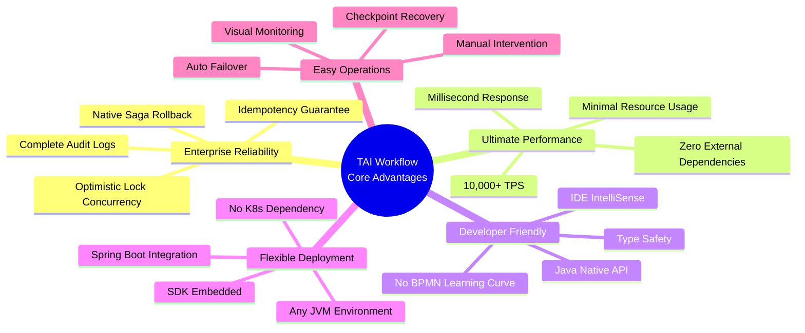

### Selection Recommendations

| If you need... | Recommended Solution |
|----------------|---------------------|
| Complex business workflows, multi-step operations, order processing | **TAI Workflow** |
| Complex approval workflows, OA systems | Apache Activiti / jBPM |
| Big data ETL, scheduled batch processing | DolphinScheduler / Airflow |
| CI/CD Pipeline, ML training | Argo Workflow |
| LLM applications, office automation | Dify / n8n |

**One-Line Summary**: TAI Workflow is a lightweight workflow engine purpose-built for **high-frequency, low-latency, strong-consistency** complex business scenarios, delivering the optimal balance of performance and reliability in business orchestration.

---

## Table of Contents

- [Project Overview](#-project-overview)
- [Core Features](#-core-features)
- [Architecture Design](#-architecture-design)
- [Module Description](#-module-description)
- [Developer Integration Guide](#-developer-integration-guide)
- [Quick Start](#-quick-start)
- [Workflow Lifecycle](#-workflow-lifecycle)
- [Core Concepts](#-core-concepts)
- [Usage Examples](#-usage-examples)
- [API Reference](#-api-reference)

---

## Project Overview

TAI Workflow Engine is an enterprise-grade workflow engine that uses a DAG (Directed Acyclic Graph) model to orchestrate and execute complex business processes. It supports:

- **Parallel Execution**: Nodes without dependencies in the DAG can execute in parallel
- **Failure Handling**: Flexible failure strategies (retry, rollback, manual processing, continue execution)
- **Signal Mechanism**: External signal triggering for asynchronous process orchestration
- **Parent-Child Workflows**: Nested workflows for complex business scenarios
- **Failover**: Database-based distributed failover mechanism

---

## Core Features

### DAG Workflow Execution Model

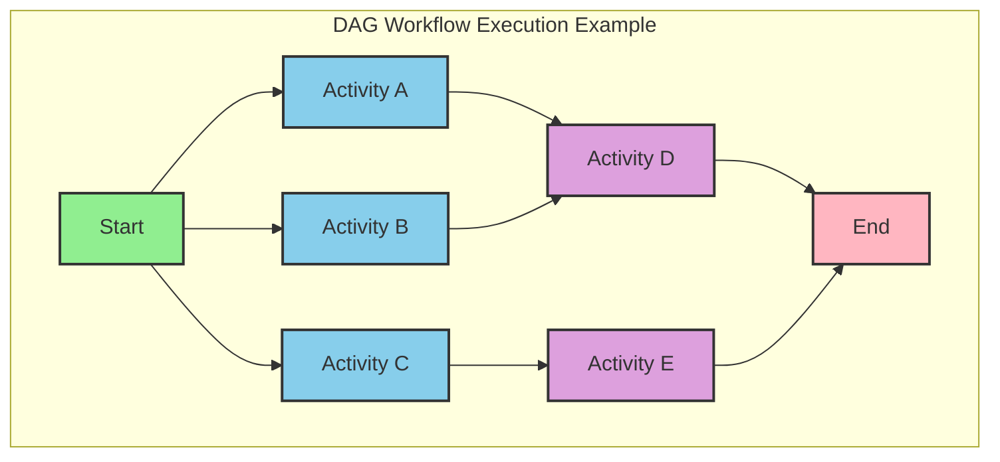

### Feature Matrix

| Feature | Description | Status |
|---------|-------------|--------|
| Start Workflow | Start via definition name or full definition | Supported |
| Retry Workflow | Resume execution from checkpoint after failure | Supported |
| Terminate Workflow | Force terminate a running workflow | Supported |
| Rollback Workflow | Rollback executed nodes in reverse topological order | Supported |
| Signal Trigger | External signal triggers waiting nodes to continue | Supported |
| Skip Activity | Skip failed or waiting activities | Supported |
| Parent-Child Workflow | Support nested sub-workflows | Supported |
| Context Passing | Share context data between Activities | Supported |

---

## Architecture Design

### Overall Architecture

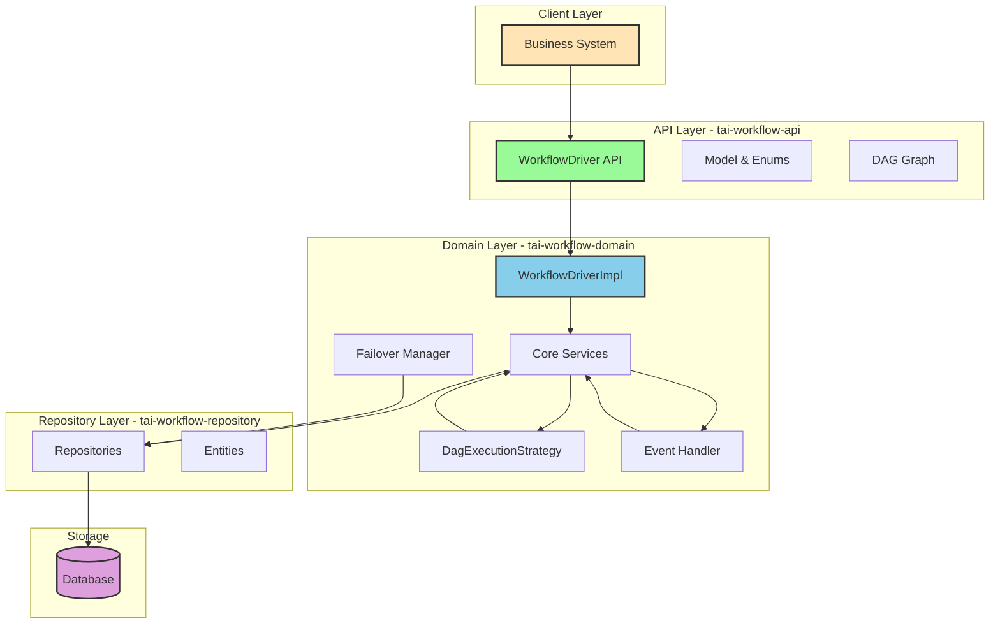

### Execution Strategy Flow

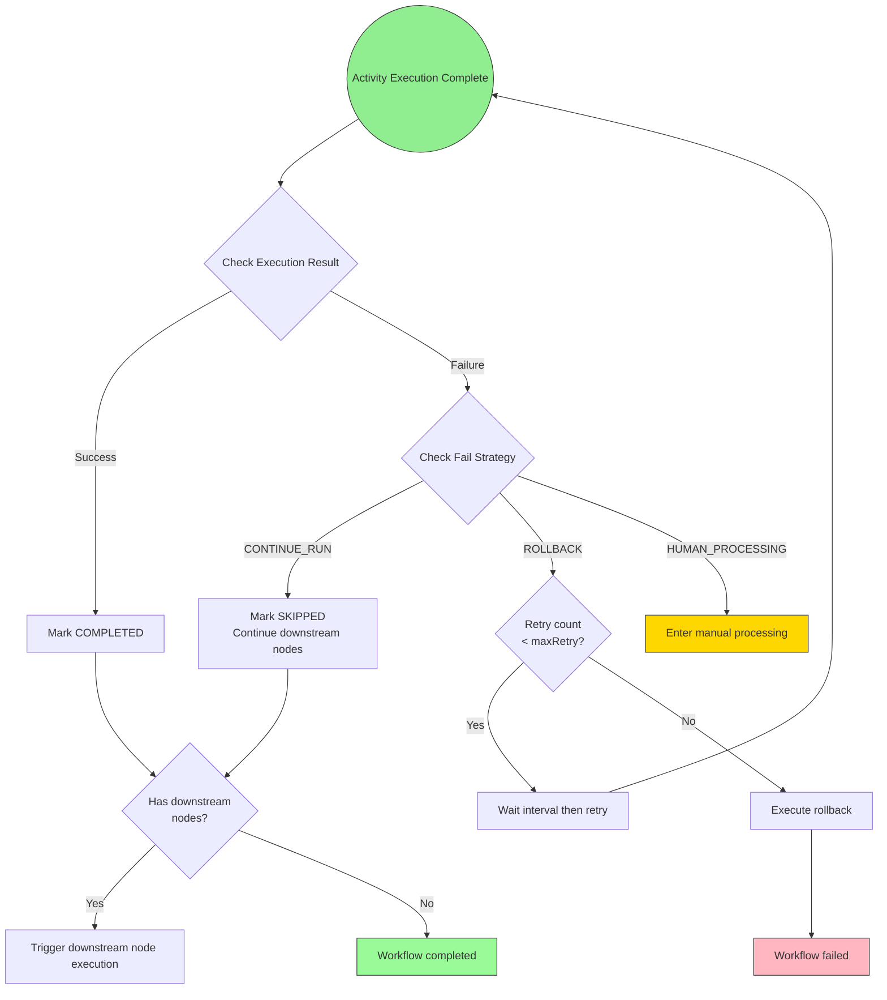

---

## Module Description

```
tai-workflow/
+-- tai-workflow-api/          # API Interface Layer
|   +-- api/                    # Core interface definitions
|   |   +-- Activity.java       # Activity interface
|   |   +-- WorkflowDriver.java # Workflow driver interface
|   +-- enums/                  # Enum definitions
|   |   +-- ActivityState.java      # Activity states
|   |   +-- WorkflowState.java      # Workflow states
|   |   +-- ActivityFailStrategy.java # Fail strategies
|   |   +-- SignalAction.java       # Signal actions
|   +-- graph/                  # DAG graph structure
|   |   +-- WorkflowDag.java        # DAG definition
|   |   +-- WorkflowDagNode.java    # DAG node
|   |   +-- TopologicalSortIterator.java # Topological sort
|   +-- model/                  # Data models
|       +-- WorkflowDefinition.java # Workflow definition
|       +-- ActivityDefinition.java # Activity definition
|       +-- WorkflowContext.java    # Execution context
|
+-- tai-workflow-domain/       # Domain Layer Implementation
|   +-- api/                    # WorkflowDriver implementation
|   +-- executor/               # DAG execution engine
|   |   +-- strategy/           # Execution strategies
|   +-- handler/                # Event handlers
|   +-- service/                # Core services
|   +-- failover/               # Failover
|
+-- tai-workflow-repository/   # Persistence Layer
    +-- entity/                 # Database entities
    +-- repository/             # Data access
```

---

## Developer Integration Guide

### Step 1: Add Dependency

Add the `tai-workflow-domain` dependency to your project's `pom.xml`:

```xml
<dependency>
    <groupId>com.tai</groupId>
    <artifactId>tai-workflow-domain</artifactId>
    <version>1.0.0-SNAPSHOT</version>
</dependency>
```

> `tai-workflow-domain` transitively includes `tai-workflow-api` and `tai-workflow-repository`, so no additional dependencies are needed.

### Step 2: Create Database Tables

Use the `workflow.sql` script in the project root directory to initialize the database tables:

```bash
mysql -u <username> -p <database_name> < workflow.sql
```

This script creates the core tables required by the workflow engine (workflow instance table, Activity instance table, etc.).

---

## Quick Start

### 1. Add Dependency

```xml
<dependency>
    <groupId>com.tai</groupId>
    <artifactId>tai-workflow-domain</artifactId>
    <version>1.0.0-SNAPSHOT</version>
</dependency>
```

### 2. Implement an Activity

```java
@Component
public class ReserveCarActivity implements Activity {

    @Override
    public ActivityExecutionResult invoke(WorkflowContext context) {
        // Get context parameters
        String userId = context.getContextParam("userId", String.class);

        // Execute business logic
        String carId = carService.reserve(userId);

        // Return result with output parameters
        return ActivityExecutionResult.ofSucceeded(Map.of("carId", carId));
    }

    @Override
    public void rollback(WorkflowContext context) {
        String carId = context.getContextParam("carId", String.class);
        carService.cancelReservation(carId);
    }
}
```

### 3. Define and Start a Workflow

```java
@Autowired
private WorkflowDriver workflowDriver;

public void startTravelWorkflow() {
    WorkflowDefinition definition = WorkflowDefinition.builder()
        .name("travel-booking-workflow")
        .displayName("Travel Booking Workflow")
        .description("Book car, hotel, and tickets")

        // Define nodes
        .addNode(ActivityDefinition.builder()
            .name("reserveCar")
            .displayName("Reserve Car")
            .activityClass(ReserveCarActivity.class)
            .activityFailStrategy(ActivityFailStrategy.ROLLBACK)
            .maxRetry(3)
            .retryIntervalMillis(5000)
            .build())
        .addNode(ActivityDefinition.builder()
            .name("reserveHotel")
            .displayName("Reserve Hotel")
            .activityClass(ReserveHotelActivity.class)
            .activityFailStrategy(ActivityFailStrategy.ROLLBACK)
            .build())
        .addNode(ActivityDefinition.builder()
            .name("reserveTicket")
            .displayName("Reserve Ticket")
            .activityClass(ReserveTicketActivity.class)
            .signalBizCode("ticket_confirmed")  // Requires external signal confirmation
            .build())
        .addNode(ActivityDefinition.builder()
            .name("sendNotification")
            .displayName("Send Notification")
            .activityClass(NotificationActivity.class)
            .build())

        // Define edges (dependencies)
        .addEdge("reserveCar", List.of("reserveHotel", "reserveTicket"))
        .addEdge(Set.of("reserveHotel", "reserveTicket"), "sendNotification")

        .build();

    // Start the workflow
    Long workflowInstanceId = workflowDriver.startWorkflowInstance(
        definition,
        "unique-token-123"  // Idempotency token
    );
}
```

---

## Workflow Lifecycle

### Workflow State Transitions

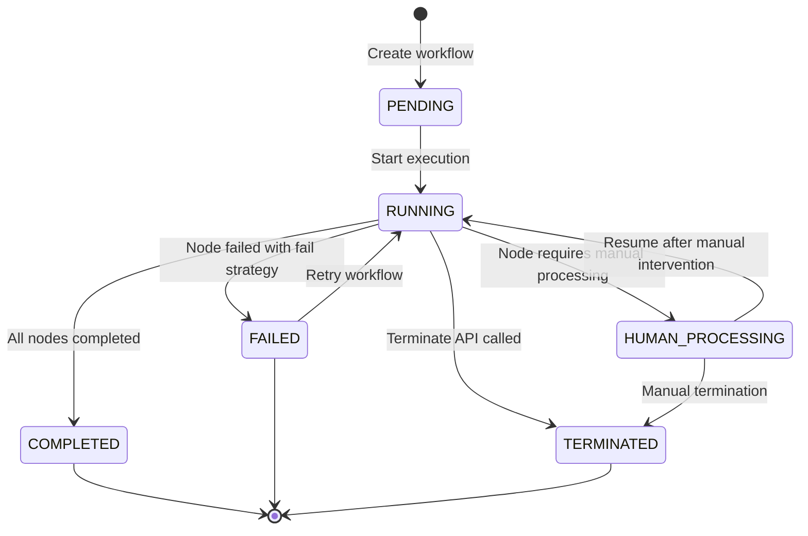

### Activity State Transitions

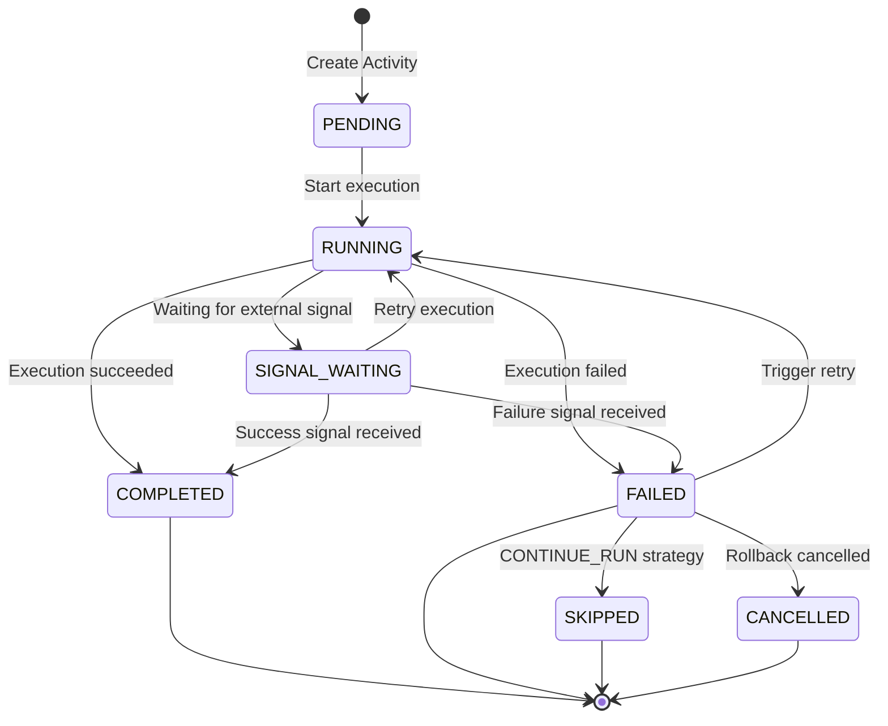

---

## Core Concepts

### 1. WorkflowDefinition

The workflow definition describes the entire process structure:

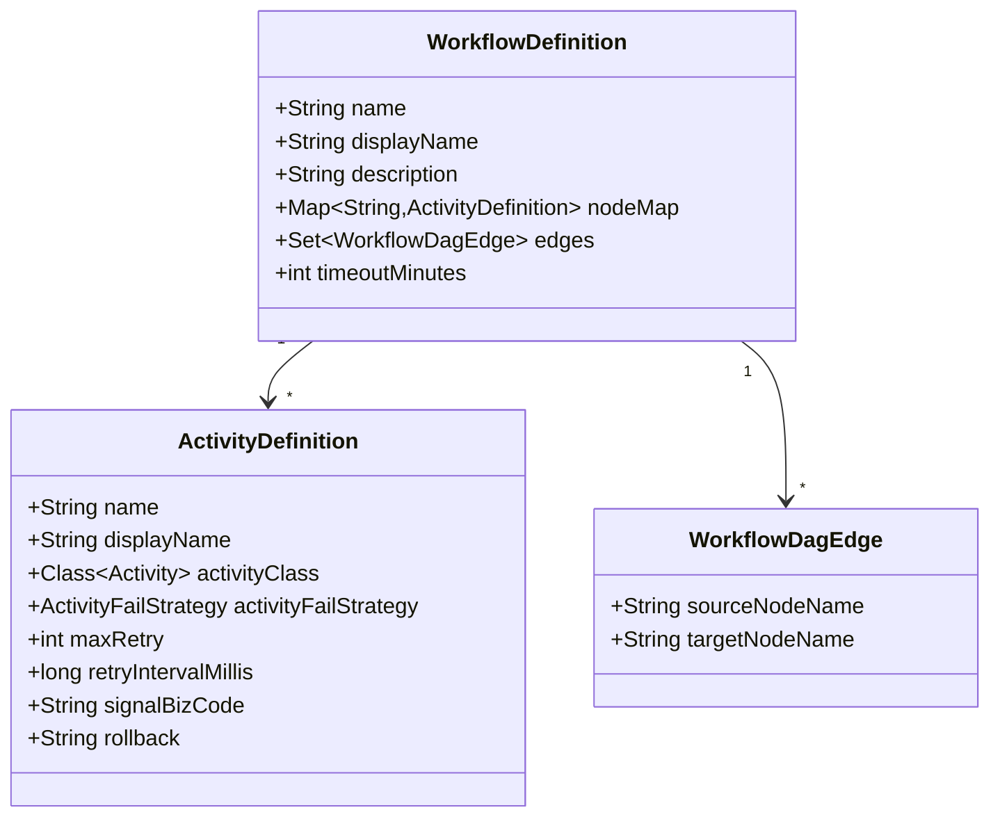

### 2. Activity

Activity is the basic execution unit of a workflow:

```java
public interface Activity {
    /**
     * Execute business logic
     */
    ActivityExecutionResult invoke(WorkflowContext context);

    /**
     * Rollback logic (optional implementation)
     */
    default void rollback(WorkflowContext context) {}
}
```

### 3. ActivityFailStrategy

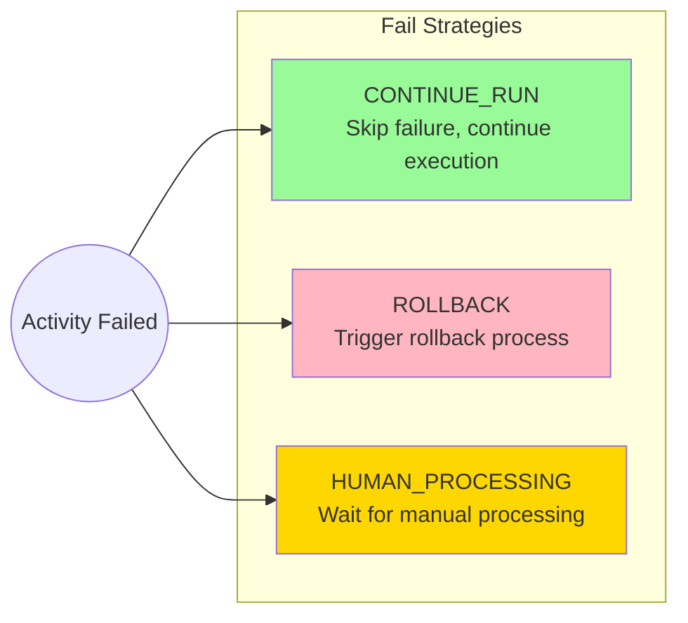

### 4. Signal Mechanism

Supports external systems triggering workflow continuation via signals:

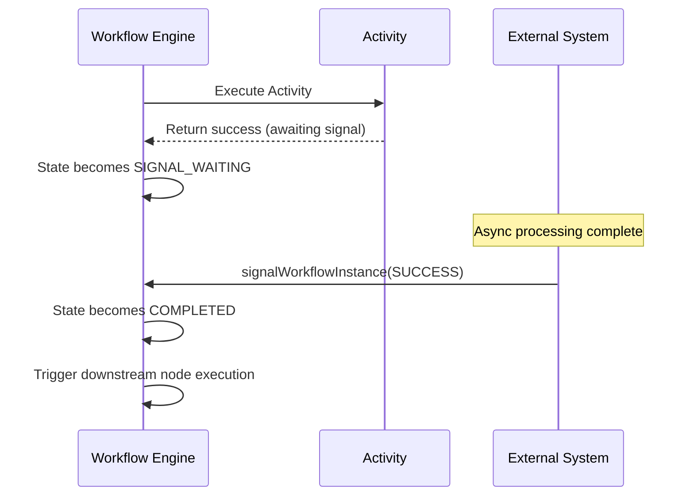

---

## Usage Examples

### Example 1: Parallel Execution

```java
// Create a parallel execution DAG
WorkflowDefinition definition = WorkflowDefinition.builder()
    .name("parallel-workflow")
    .addNode(ActivityDefinition.builder()
        .name("start").activityClass(StartActivity.class).build())
    .addNode(ActivityDefinition.builder()
        .name("taskA").activityClass(TaskAActivity.class).build())
    .addNode(ActivityDefinition.builder()
        .name("taskB").activityClass(TaskBActivity.class).build())
    .addNode(ActivityDefinition.builder()
        .name("taskC").activityClass(TaskCActivity.class).build())
    .addNode(ActivityDefinition.builder()
        .name("end").activityClass(EndActivity.class).build())

    // After start completes, taskA, taskB, taskC execute in parallel
    .addEdge("start", List.of("taskA", "taskB", "taskC"))
    // After taskA, taskB, taskC all complete, execute end
    .addEdge(Set.of("taskA", "taskB", "taskC"), "end")
    .build();
```

Corresponding DAG structure:

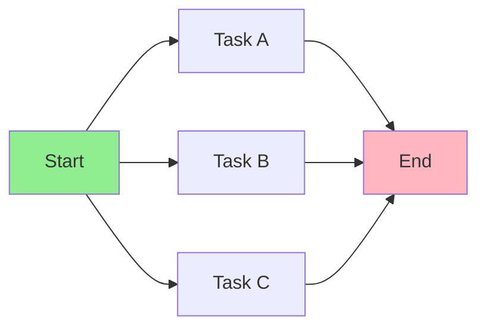

### Example 2: Workflow with Retry and Rollback

```java
WorkflowDefinition definition = WorkflowDefinition.builder()
    .name("saga-workflow")
    .addNode(ActivityDefinition.builder()
        .name("deductInventory")
        .activityClass(DeductInventoryActivity.class)
        .activityFailStrategy(ActivityFailStrategy.ROLLBACK)
        .maxRetry(3)
        .retryIntervalMillis(1000)
        .build())
    .addNode(ActivityDefinition.builder()
        .name("createOrder")
        .activityClass(CreateOrderActivity.class)
        .activityFailStrategy(ActivityFailStrategy.ROLLBACK)
        .build())
    .addNode(ActivityDefinition.builder()
        .name("processPayment")
        .activityClass(PaymentActivity.class)
        .activityFailStrategy(ActivityFailStrategy.ROLLBACK)
        .signalBizCode("payment_callback")  // Wait for payment callback
        .build())
    .addEdge("deductInventory", "createOrder")
    .addEdge("createOrder", "processPayment")
    .build();
```

Rollback flow:

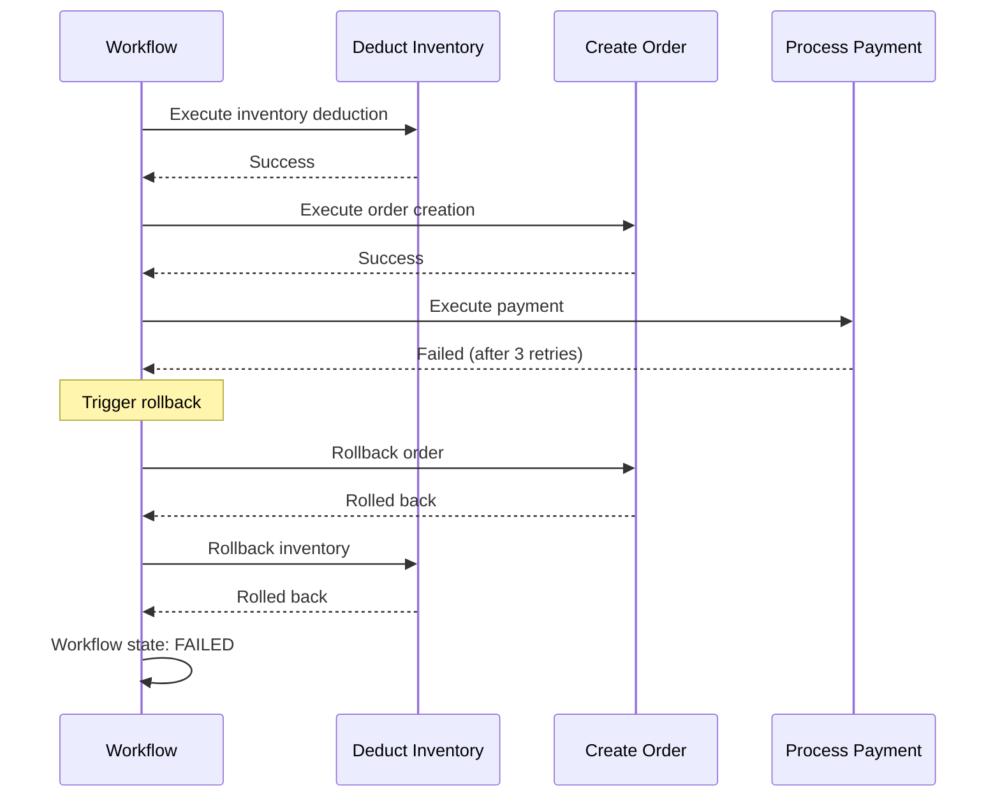

### Example 3: Using Signal Waiting

```java
// Start a workflow with signal waiting
Long workflowId = workflowDriver.startWorkflowInstance(definition);

// ... Wait for external system processing ...

// Send success signal
workflowDriver.signalWorkflowInstance(
    workflowId,
    "payment_callback",      // signalBizCode
    SignalAction.SUCCESS,    // Signal action
    Map.of("transactionId", "TXN123")  // Additional context
);

// Or send failure signal
workflowDriver.signalWorkflowInstance(
    workflowId,
    "payment_callback",
    SignalAction.FAILED_NORMAL  // Normal failure, will trigger retry
);
```

---

## API Reference

### WorkflowDriver Interface

| Method | Description |
|--------|-------------|
| `registerWorkflowDefinition(WorkflowDefinition)` | Register a workflow definition |
| `startWorkflowInstance(String, Map, String)` | Start workflow by definition name |
| `startWorkflowInstance(WorkflowDefinition, String)` | Start workflow by definition object |
| `retryWorkflowInstance(Long)` | Retry a failed workflow |
| `signalWorkflowInstance(Long, String, SignalAction, Map)` | Send signal to a waiting workflow |
| `rollbackWorkflowInstance(Long)` | Rollback a workflow |
| `terminateWorkflowInstance(Long)` | Terminate a workflow |
| `skipWorkflowInstance(Long, List)` | Skip specified Activities |
| `getWorkflowInstance(Long)` | Get a workflow instance |
| `listActivityInstances(Long)` | List all Activity instances of a workflow |

### SignalAction Enum

| Value | Description |
|-------|-------------|
| `SUCCESS` | Signal success, continue executing downstream nodes |
| `FAILED_NORMAL` | Normal failure, will retry based on configuration |
| `FAILED_AT_ONCE` | Immediate failure, skip retry and enter failure handling |
| `TERMINATED` | Directly terminate the workflow |

---

## Advanced Features

### Topological Sort Execution

The workflow engine uses topological sorting to ensure nodes execute in the correct order:

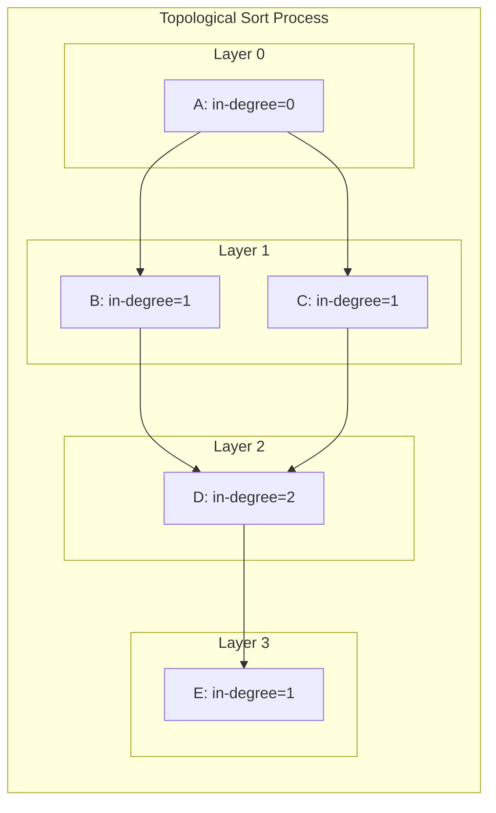

### Distributed Failover

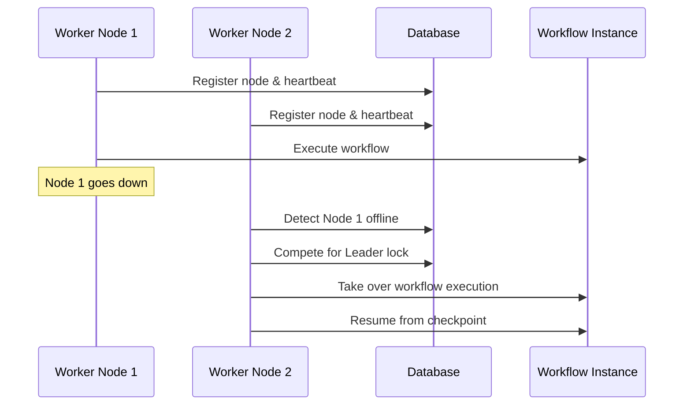

---

## Monitoring Metrics

Recommended key metrics to monitor:

- Workflow execution success rate
- Average execution time
- Activity retry count distribution
- Number of workflows waiting for signals
- Number of failed and manually-processing workflows

---

## Contributing

1. Fork this repository
2. Create a feature branch (`git checkout -b feature/amazing-feature`)
3. Commit your changes (`git commit -m 'Add some amazing feature'`)
4. Push to the branch (`git push origin feature/amazing-feature`)
5. Create a Pull Request

---

## License

This project is an internal TAI project. All rights reserved by TAI.

---

## Contact Us

- **Project Maintainer**: zhanghaolong1989@163.com
